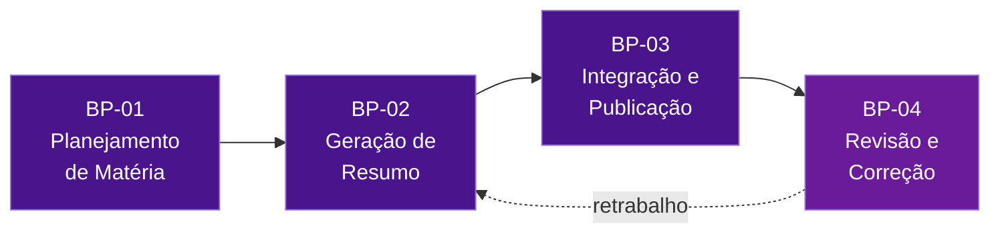
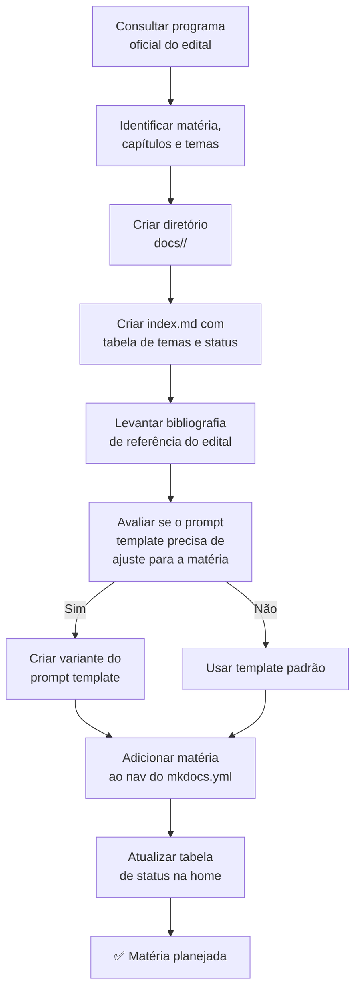
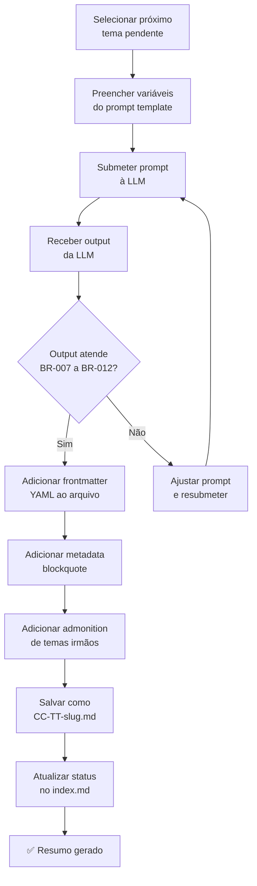
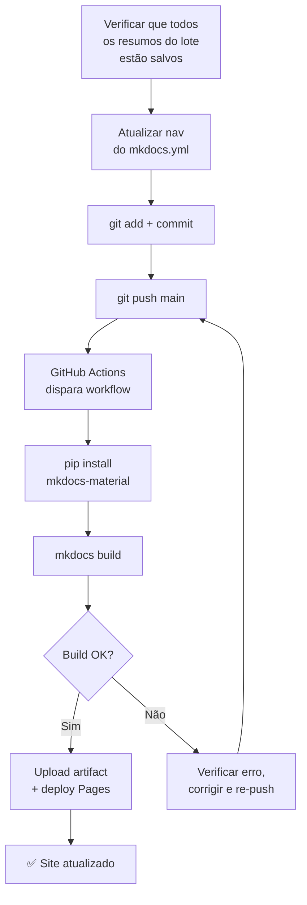
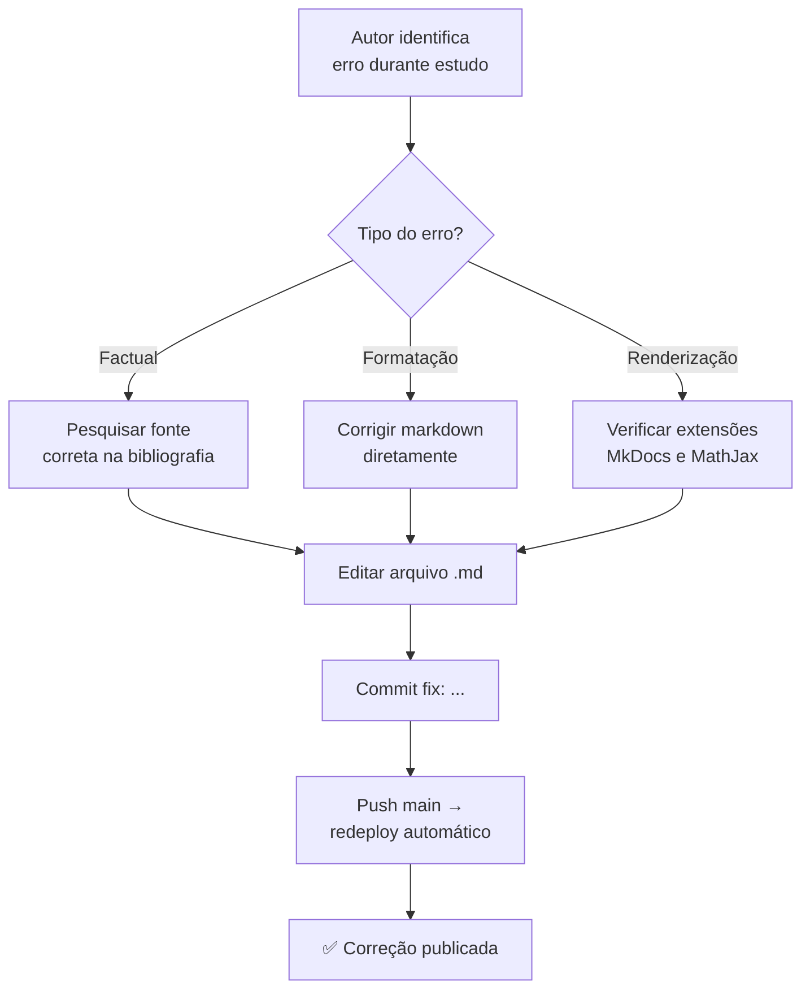
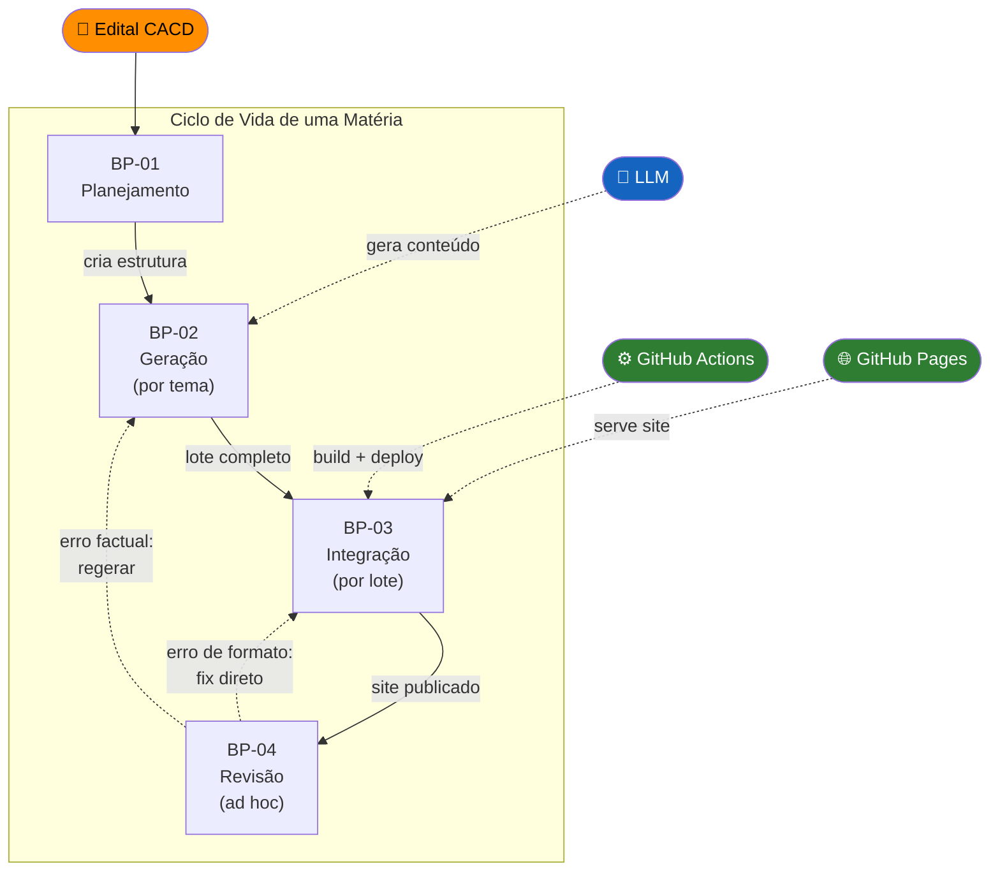

# Processos de Negócio — Study Vault

> **Artefato RUP:** Processos de Negócio (Modelagem de Negócios)
> **Proprietário:** [RUP] Analista de Negócios
> **Status:** Complete
> **Última atualização:** Reverse-engineered from source code (2026-07-19)
>
> ⚠️ Este artefato foi INFERIDO a partir da análise da implementação existente. Pode não refletir integralmente a intenção original do criador.

---

## Visão Geral dos Processos

O Study Vault opera com **4 processos de negócio** macro, todos executados pelo Autor (SH-01), com apoio de atores de sistema. Não há processos automatizados end-to-end — a automação está concentrada exclusivamente na etapa de publicação.

---

## BP-01 — Planejamento de Matéria

| Atributo | Descrição |
|----------|-----------|
| **Objetivo** | Definir o escopo de uma nova matéria a ser coberta pelo Study Vault |
| **Gatilho** | Decisão do Autor de adicionar uma matéria ao projeto |
| **Atores** | Autor (SH-01) |
| **Resultado esperado** | Diretório criado, `index.md` pronto com listagem completa de capítulos/temas, seção adicionada ao `nav` do `mkdocs.yml` e à tabela de status do `docs/index.md` |

### Fluxo

### Passos Detalhados

| # | Passo | Regras Aplicáveis | Observação |
|---|-------|--------------------|------------|
| 1 | Consultar o programa oficial do edital do CACD 2026 | — | O edital é a fonte primária e irrefutável da árvore de conteúdo |
| 2 | Identificar matéria, capítulos e temas com suas numerações | BR-001, BR-013 | A numeração do edital define os prefixos CC-TT dos arquivos |
| 3 | Criar diretório `docs/<matéria>/` em kebab-case | BR-014 | Ex: `docs/historia-mundial/`, `docs/economia/` |
| 4 | Criar `index.md` com tabela de capítulos, temas, links e status | BR-015 | Status inicial de cada tema: pendente |
| 5 | Levantar bibliografia de referência do edital para a matéria | — | Alimentará a variável `{bibliografia}` do prompt |
| 6 | Avaliar se o prompt template padrão atende à natureza da matéria | BR-027 | Ex: Economia exige MathJax; Direito exige citação de artigos legais |
| 7 | Se necessário, criar variante do prompt em `scripts/prompts/` | BR-019 | O template é fonte canônica — variantes devem ser versionadas |
| 8 | Adicionar a matéria e seus capítulos/temas ao `nav` do `mkdocs.yml` | BR-016 | Hierarquia: Matéria > Capítulo > Tema |
| 9 | Atualizar tabela de matérias na `docs/index.md` (home) | — | Status inicial da matéria: "Em andamento" |

### Frequência
Uma vez por matéria. Até o momento executado 2 vezes (História Mundial, Economia).

---

## BP-02 — Geração de Resumo

| Atributo | Descrição |
|----------|-----------|
| **Objetivo** | Gerar um resumo denso para um tema específico do edital |
| **Gatilho** | Tema pendente na listagem de uma matéria planejada |
| **Atores** | Autor (SH-01), LLM (SA-01) |
| **Pré-condição** | BP-01 concluído para a matéria |
| **Resultado esperado** | Arquivo `.md` completo com frontmatter, metadata, admonition e 5 seções de conteúdo |

### Fluxo

### Passos Detalhados

| # | Passo | Regras Aplicáveis | Observação |
|---|-------|--------------------|------------|
| 1 | Selecionar próximo tema pendente no `index.md` da matéria | BR-001 | Um tema → um arquivo |
| 2 | Preencher as variáveis do prompt template: `{concurso}`, `{materia}`, `{capitulo}`, `{tema}`, `{subtemas_irmaos}`, `{bibliografia}` | BR-019 | As variáveis estão documentadas em `scripts/prompts/summary.md` |
| 3 | Submeter o prompt preenchido à LLM (manualmente, via chat) | — | Não há automação via API neste momento |
| 4 | Avaliar o output: verifica presença das 5 seções, extensão (2.000–4.000 palavras), precisão factual percebida, autores citados | BR-007, BR-008, BR-010, BR-011, BR-012 | Avaliação subjetiva pelo Autor — não há checklist formal |
| 5 | Se insatisfatório, ajustar prompt (mais contexto, restrições adicionais) e resubmeter | — | Loop iterativo; raramente > 2 tentativas |
| 6 | Adicionar frontmatter YAML ao topo do arquivo | BR-002, BR-003 | Campos: `title`, `edital_ref`, `capitulo`, `status` |
| 7 | Adicionar metadata blockquote abaixo do título | BR-005 | Concurso, Matéria, Capítulo, Referência, Status |
| 8 | Adicionar admonition de temas irmãos | BR-006 | Lista de todos os temas do mesmo capítulo |
| 9 | Salvar o arquivo com naming padronizado | BR-013 | Ex: `01-05-crise-de-1929-e-new-deal.md` |
| 10 | Atualizar status do tema no `index.md` da matéria | BR-015 | De "pendente" para "completo" |

### Frequência
84 vezes até o momento (60 + 24). Executado em lotes por capítulo.

### Observação sobre Lotes
A evidência do git log sugere que o Autor gera resumos **em lotes por capítulo** (ex: commit `feat: capítulo 3 completo — 17/17 temas`). Isso indica que todos os temas de um capítulo são gerados em sequência antes de passar ao próximo, provavelmente para manter o contexto dos `{subtemas_irmaos}` fresco.

---

## BP-03 — Integração e Publicação

| Atributo | Descrição |
|----------|-----------|
| **Objetivo** | Publicar os resumos gerados no site estático via GitHub Pages |
| **Gatilho** | Um ou mais resumos gerados (BP-02 concluído para um lote) |
| **Atores** | Autor (SH-01), GitHub Actions (SA-03), GitHub Pages (SA-04) |
| **Resultado esperado** | Site atualizado com os novos resumos, navegáveis e buscáveis |

### Fluxo

### Passos Detalhados

| # | Passo | Regras Aplicáveis | Observação |
|---|-------|--------------------|------------|
| 1 | Verificar que os arquivos markdown estão corretos e salvos | BR-017 | Cada arquivo deve ter entrada no `nav` |
| 2 | Atualizar `nav` do `mkdocs.yml` com os novos temas | BR-016, BR-017 | Operação manual — risco de esquecer um tema |
| 3 | Commit com mensagem descritiva (padrão Conventional Commits observado) | — | Ex: `feat: capítulo 3 completo — 17/17 temas` |
| 4 | Push para `main` | BR-024 | Direto para produção — sem staging |
| 5 | GitHub Actions executa workflow `deploy.yml` automaticamente | BR-022, BR-023 | Python 3.12, mkdocs-material |
| 6 | Se build falhar, verificar erro (markdown malformado, YAML inválido) e corrigir | — | Erros comuns: indentação YAML, referência a arquivo inexistente |
| 7 | Site publicado no GitHub Pages | — | Atualização em ~2-3 minutos |

### Frequência
10 vezes até o momento (10 commits no repositório).

---

## BP-04 — Revisão e Correção

| Atributo | Descrição |
|----------|-----------|
| **Objetivo** | Corrigir erros factuais, de formatação ou de renderização nos resumos publicados |
| **Gatilho** | Autor identifica problema durante estudo ou navegação no site |
| **Atores** | Autor (SH-01) |
| **Resultado esperado** | Resumo corrigido e republicado |

### Fluxo

### Observação
Este processo é **informal e reativo**. Não há:
- Checklist de revisão
- Rotina periódica de auditoria
- Rastreamento de erros encontrados/corrigidos
- Distinção entre severidades de erro

A evidência de commits como `fix: corrige renderização de fórmulas e erros de texto` confirma que correções acontecem, mas de forma ad hoc.

---

## Diagrama de Interação entre Processos

---

## Métricas de Processo Observadas

| Métrica | Valor Observado | Observação |
|---------|-----------------|------------|
| Total de matérias planejadas (BP-01) | 2 | História Mundial, Economia |
| Total de resumos gerados (BP-02) | 84 | 60 + 24 |
| Total de deploys (BP-03) | ~10 | Baseado no git log |
| Ciclo de geração por capítulo | 1 commit por capítulo | Sugere geração em lote |
| Commits de correção (BP-04) | ≥2 | `fix: corrige renderização...`, `fix: atualizar status...` |
| Automação do pipeline | ~25% | Apenas deploy é automatizado (BP-03 parcial). Geração, integração manual e revisão são 100% manuais. |
