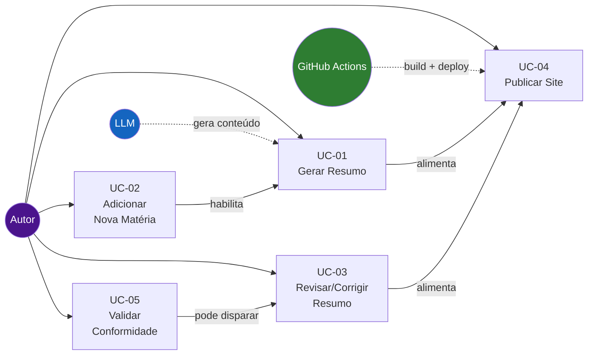

# Casos de Uso — Study Vault

> **Artefato RUP:** Especificação de Casos de Uso (Requisitos)
> **Proprietário:** [RUP] Analista de Requisitos
> **Status:** Complete
> **Última atualização:** Reverse-engineered from source code (2026-07-19)
>
> ⚠️ Casos de uso foram INFERIDOS a partir dos processos de negócio observados (BP-01 a BP-04) e complementados com ações prescritivas derivadas dos requisitos (RF-01 a RF-41).

---

## Visão Geral dos Casos de Uso

---

### UC-01: Gerar Resumo para Tema Novo

**Ator:** Autor (SH-01)
**Ator de suporte:** LLM (SA-01)
**Gatilho:** Existe um tema com status `pendente` no `index.md` de uma matéria planejada
**Pré-condições:**
- UC-02 concluído para a matéria
- Prompt template (base ou variante) disponível para a matéria
- Bibliografia de referência levantada

**Pós-condições:**
- Arquivo `.md` criado no diretório da matéria com naming padronizado (RF-17)
- Frontmatter completo com todos os campos obrigatórios (RF-02, RF-05, RF-06)
- 5 seções obrigatórias presentes (RF-09)
- Extensão entre 2.000 e 4.000 palavras (RF-22)
- Status do tema atualizado no `index.md` da matéria
- Rodapé com disclaimer e modelo LLM presente (RF-11)

**Requisitos Relacionados:** RF-01, RF-02, RF-03, RF-04, RF-05, RF-06, RF-07, RF-08, RF-09, RF-10, RF-11, RF-12, RF-13, RF-14, RF-15, RF-16, RF-17, RF-22, RF-23, RF-24, RF-25, RF-27, RF-28

#### Fluxo Principal

| # | Ação | Regras/RFs Aplicáveis |
|---|------|-----------------------|
| 1 | Autor seleciona o próximo tema com status `pendente` no `index.md` da matéria. | RF-01 |
| 2 | Autor preenche as variáveis do prompt template: `{concurso}`, `{materia}`, `{capitulo}`, `{tema}`, `{subtemas_irmaos}`, `{bibliografia}`. | RF-28 |
| 3 | Autor seleciona o modelo LLM a ser usado e registra o identificador (ex: `gpt-4o`). | RF-06 |
| 4 | Autor submete o prompt preenchido à LLM (manualmente, via interface do modelo). | — |
| 5 | LLM retorna o conteúdo gerado. | — |
| 6 | Autor avalia o output quanto a: (a) presença das 5 seções obrigatórias, (b) extensão dentro da faixa 2.000–4.000 palavras, (c) precisão factual percebida, (d) autores citados, (e) pluralidade interpretativa, (f) precisão de datas. | RF-09, RF-22, RF-23, RF-13, RF-14, RF-15 |
| 7 | Autor adiciona o frontmatter YAML ao topo do arquivo com os campos: `title` (formato padronizado), `edital_ref`, `capitulo`, `materia`, `concurso`, `status: completo`, `data_geracao`, `modelo_llm`. | RF-02, RF-03, RF-04, RF-05, RF-06 |
| 8 | Autor adiciona o metadata blockquote abaixo do título H1. | RF-07 |
| 9 | Autor adiciona a admonition de temas irmãos. | RF-08 |
| 10 | Autor adiciona o disclaimer na seção Top 5 (percepção da LLM, não análise factual). | RF-16 |
| 11 | Autor adiciona o rodapé: `*Gerado por IA ({modelo_llm}). Sujeito a revisão.*` | RF-11 |
| 12 | Autor salva o arquivo com naming padronizado: `CC-TT-slug.md`. | RF-17 |
| 13 | Autor atualiza o status do tema no `index.md` da matéria de `pendente` para `completo`. | RF-19 |

#### Fluxos Alternativos

- **AF-01: Output insatisfatório.** Se no passo 6 o output não atende os critérios, o Autor ajusta o prompt (mais contexto, restrições adicionais) e resubmete (volta ao passo 4). Loop esperado: ≤ 2 iterações.
- **AF-02: Geração em lote.** O Autor pode gerar todos os temas de um capítulo em sequência (padrão observado nos commits). Neste caso, o passo 13 é executado uma vez ao final do lote, atualizando todos os temas do capítulo.
- **AF-03: Matéria quantitativa.** Se a matéria é de natureza analítica/quantitativa (ex: Economia), as seções de conteúdo (Contexto, Desenvolvimento, Interpretações) podem ser organizadas por subseções temáticas numeradas (RF-10), mas Conexões e Top 5 permanecem como seções finais nomeadas.

#### Fluxos de Exceção

- **EF-01: LLM indisponível.** Se a LLM não está acessível, o Autor usa outro modelo disponível — registrando o modelo efetivamente usado no campo `modelo_llm`.
- **EF-02: Tema com escopo ambíguo no edital.** Se o tema é impreciso no programa do edital (ex: temas compostos como `4.1–4.2`), o Autor decide a granularidade mantendo o princípio 1:1 (RF-01) e documenta a decisão no frontmatter via comentário YAML ou no admonition.

---

### UC-02: Adicionar Nova Matéria ao Projeto

**Ator:** Autor (SH-01)
**Gatilho:** Decisão do Autor de cobrir uma nova matéria do edital
**Pré-condições:**
- Programa oficial do edital disponível para a matéria
- Repositório acessível e commit possível

**Pós-condições:**
- Diretório `docs/<materia>/` criado
- `index.md` criado com todos os temas do edital listados e status `pendente`
- Matéria adicionada ao `nav` do `mkdocs.yml`
- Tabela de matérias no `docs/index.md` atualizada
- Variante do prompt template criada (se necessário)

**Requisitos Relacionados:** RF-18, RF-19, RF-20, RF-21, RF-27, RF-29, RF-35, RF-36, RF-37, NFR-09

#### Fluxo Principal

| # | Ação | Regras/RFs Aplicáveis |
|---|------|-----------------------|
| 1 | Autor consulta o programa oficial do edital do concurso para a matéria-alvo. | — |
| 2 | Autor identifica todos os capítulos e temas com suas numerações oficiais. | — |
| 3 | Autor cria o diretório `docs/<materia>/` com nome em kebab-case sem acentos. | RF-18 |
| 4 | Autor cria `index.md` com: metadata blockquote (concurso, fase, total capítulos, total temas), tabela por capítulo com todos os temas listados, links previstos (formato `CC-TT-slug.md`) e status `pendente` para todos. | RF-19, RF-37 |
| 5 | Autor levanta a bibliografia de referência do edital para a matéria. | — |
| 6 | Autor avalia se o prompt template base atende à natureza da matéria. | RF-29 |
| 7 | Se necessário, autor cria variante `scripts/prompts/summary-{materia}.md` documentando diferenças em relação ao template base. | RF-29 |
| 8 | Autor adiciona a matéria e seus capítulos/temas à seção `nav` do `mkdocs.yml`, respeitando a hierarquia Matéria > Capítulo > Tema. | RF-20 |
| 9 | Autor atualiza a tabela de matérias no `docs/index.md` com: nome (link), capítulos, temas, status "Em andamento". | RF-34 |
| 10 | Autor commita e pusha as alterações (dispara deploy automático). | RF-30 |

#### Fluxos Alternativos

- **AF-01: Matéria com subtemas compostos.** Se o edital agrupa múltiplos subtemas sob um mesmo número (ex: Economia `4.1–4.2`), o Autor decide se mantém como arquivo único ou separa, respeitando RF-01 (1 tema → 1 arquivo). Documenta a decisão no `index.md`.
- **AF-02: Template base suficiente.** Se no passo 6 o template base atende (sem MathJax, sem citação de artigos legais, etc.), pula o passo 7.

#### Fluxos de Exceção

- **EF-01: Edital ainda não publicado para a matéria.** Se o programa oficial não está disponível, a matéria não pode ser planejada. O Autor aguarda publicação.
- **EF-02: Nome de diretório conflitante.** Se o nome em kebab-case gera conflito com diretório existente, o Autor adiciona sufixo diferenciador (improvável com as matérias do CACD).

---

### UC-03: Revisar e Corrigir Resumo Existente

**Ator:** Autor (SH-01)
**Gatilho:** Autor identifica erro factual, de formatação, de renderização ou de conformidade durante estudo ou navegação
**Pré-condições:**
- Resumo publicado e acessível no site ou no repositório

**Pós-condições:**
- Resumo corrigido e salvo no repositório
- Se a correção foi factual substantiva, `status` pode ser alterado para `em_revisao` e depois de volta a `completo`
- Commit com mensagem descritiva (`fix: ...`)

**Requisitos Relacionados:** RF-04, RF-22, RF-24, RF-25, BP-04

#### Fluxo Principal

| # | Ação | Regras/RFs Aplicáveis |
|---|------|-----------------------|
| 1 | Autor identifica o problema (durante estudo, navegação no site, ou validação UC-05). | — |
| 2 | Autor classifica o tipo de erro: factual, formatação, renderização, conformidade. | — |
| 3 | **Se factual:** Autor pesquisa a fonte correta na bibliografia de referência e corrige o trecho. | RF-23 |
| 4 | **Se formatação:** Autor corrige o markdown diretamente (negrito, listas, seções). | RF-12, RF-24 |
| 5 | **Se renderização:** Autor verifica extensões MkDocs e MathJax, corrige sintaxe. | RF-25 |
| 6 | **Se conformidade:** Autor ajusta o resumo para atender os requisitos (frontmatter incompleto, seção ausente, rodapé faltando). | RF-02 a RF-11, RF-16 |
| 7 | Autor salva o arquivo corrigido. | — |
| 8 | Autor commita com mensagem descritiva: `fix: <descrição breve do que foi corrigido>`. | — |

#### Fluxos Alternativos

- **AF-01: Erro requer regeneração.** Se o erro é tão extenso que uma correção pontual não resolve (ex: seção inteira factualmente incorreta), o Autor pode optar por regenerar o resumo via UC-01, atualizando `data_geracao` e `modelo_llm`.
- **AF-02: Correção em lote.** Se uma inconsistência afeta múltiplos resumos (ex: padronização de frontmatter BR-028), o Autor pode corrigir todos em um único commit: `fix: padroniza frontmatter de Economia conforme RF-03`.

#### Fluxos de Exceção

- **EF-01: Divergência entre fontes bibliográficas.** Se diferentes autores divergem sobre um fato, o Autor não "corrige" para uma das versões — adiciona a pluralidade (RF-15).
- **EF-02: Erro introduzido pela correção.** Se a correção causa novo problema (ex: quebra de fórmula MathJax), o Autor detecta via build ou navegação e corrige iterativamente.

---

### UC-04: Publicar Site Atualizado

**Ator:** Autor (SH-01)
**Atores de suporte:** GitHub Actions (SA-03), GitHub Pages (SA-04)
**Gatilho:** Um ou mais resumos gerados (UC-01), matéria adicionada (UC-02), ou correção feita (UC-03)
**Pré-condições:**
- Alterações commitadas no repositório local
- Entrada no `nav` do `mkdocs.yml` para cada resumo novo (RF-21)

**Pós-condições:**
- Site publicado no GitHub Pages com as alterações
- Todos os novos resumos navegáveis e buscáveis

**Requisitos Relacionados:** RF-20, RF-21, RF-30, RF-31, RF-34, NFR-12, NFR-13, NFR-14

#### Fluxo Principal

| # | Ação | Regras/RFs Aplicáveis |
|---|------|-----------------------|
| 1 | Autor verifica que todos os arquivos markdown do lote estão salvos e corretos. | — |
| 2 | Autor verifica que o `nav` do `mkdocs.yml` contém entradas para todos os novos resumos. | RF-21 |
| 3 | Autor executa `git add` + `git commit` com mensagem descritiva (padrão Conventional Commits). | — |
| 4 | Autor executa `git push origin main`. | RF-30 |
| 5 | GitHub Actions dispara automaticamente o workflow `deploy.yml`. | RF-30, RF-31 |
| 6 | Workflow instala dependências (`pip install mkdocs-material`) e executa `mkdocs build`. | RF-31 |
| 7 | Build gera artefato e faz deploy para GitHub Pages. | — |
| 8 | Site atualizado e acessível em ~2-5 minutos. | NFR-13 |

#### Fluxos Alternativos

- **AF-01: Publicação de matéria inteira.** Quando todos os temas de uma matéria foram gerados, o Autor pode fazer um único push com todos os arquivos. Commit: `feat: <matéria> completa — X/X temas`.
- **AF-02: Build local prévio.** Antes do push, o Autor pode executar `mkdocs serve` localmente para pré-visualizar o site e detectar problemas de renderização.

#### Fluxos de Exceção

- **EF-01: Build failure.** Se `mkdocs build` falha (YAML malformado, referência a arquivo inexistente, markdown inválido), GitHub Actions reporta o erro. Autor verifica o log, corrige localmente, e faz novo push.
- **EF-02: Arquivo sem entrada no nav.** Se um resumo existe no repositório mas não tem entrada no `nav`, ele não aparece no site. Autor adiciona a entrada e faz novo push.

---

### UC-05: Validar Conformidade de Resumo vs. Especificação

**Ator:** Autor (SH-01)
**Gatilho:** Após geração de lote de resumos (UC-01), ou periodicamente para auditoria de qualidade
**Pré-condições:**
- Resumos gerados e salvos no repositório
- Requisitos documentados (este documento)

**Pós-condições:**
- Relatório de conformidade: lista de resumos verificados e desvios encontrados
- Desvios críticos encaminhados para correção via UC-03

**Requisitos Relacionados:** RF-02, RF-03, RF-05, RF-06, RF-07, RF-08, RF-09, RF-11, RF-16, RF-22, RF-33, NFR-06, NFR-07

#### Fluxo Principal

| # | Ação | Regras/RFs Aplicáveis |
|---|------|-----------------------|
| 1 | Autor seleciona o escopo da validação: resumo individual, capítulo, matéria inteira, ou todo o repositório. | — |
| 2 | Para cada resumo no escopo, verificar **frontmatter**: presença de todos os campos obrigatórios (`title`, `edital_ref`, `capitulo`, `materia`, `concurso`, `status`, `data_geracao`, `modelo_llm`). | RF-02, RF-05, RF-06, NFR-07 |
| 3 | Verificar **formato do título** no frontmatter: `"<ano> - <concurso> - <matéria> - <tema>"`. | RF-03 |
| 4 | Verificar **metadata blockquote** presente após o título H1. | RF-07 |
| 5 | Verificar **admonition de temas irmãos** presente. | RF-08 |
| 6 | Verificar **5 seções obrigatórias** presentes (ou, para matérias analíticas, pelo menos Conexões e Top 5 como seções finais nomeadas). | RF-09, RF-10, NFR-06 |
| 7 | Verificar **extensão** entre 2.000 e 4.000 palavras. | RF-22, NFR-05 |
| 8 | Verificar **rodapé** com disclaimer e modelo LLM. | RF-11 |
| 9 | Verificar **disclaimer na seção Top 5** (percepção da LLM). | RF-16 |
| 10 | Verificar **naming do arquivo** conforme `CC-TT-slug.md`. | RF-17 |
| 11 | Registrar desvios encontrados. Para desvios críticos (frontmatter incompleto, seção ausente), criar ação de correção via UC-03. | RF-33 |

#### Fluxos Alternativos

- **AF-01: Validação automatizada.** Se um script de validação estiver disponível (extensão futura), os passos 2 a 10 podem ser automatizados. O script deve verificar os mesmos critérios do checklist manual (RF-33).
- **AF-02: Validação de conformidade pós-padronização.** Após a migração de resumos existentes para o novo padrão (RF-38 a RF-41), executar UC-05 em todo o repositório para confirmar conformidade completa.

#### Fluxos de Exceção

- **EF-01: Resumo com desvios irreconciliáveis.** Se um resumo possui problemas estruturais tão profundos que a correção pontual é inviável (ex: conteúdo gerado sem as seções obrigatórias), encaminhar para regeneração via UC-01.
- **EF-02: Critério de validação ambíguo.** Se um requisito é interpretável de múltiplas formas (ex: organização interna de seções em matéria quantitativa), o Autor decide o caso e documenta como precedente para validações futuras.

---

## Matriz de Rastreabilidade — Casos de Uso × Requisitos × Processos de Negócio

| UC | Processo (BP) | RFs Principais | NFRs Principais |
|----|---------------|----------------|-----------------|
| UC-01 | BP-02 (Geração de Resumo) | RF-01 a RF-17, RF-22, RF-23, RF-24, RF-25, RF-27, RF-28 | NFR-05, NFR-06, NFR-07, NFR-08 |
| UC-02 | BP-01 (Planejamento de Matéria) | RF-18, RF-19, RF-20, RF-21, RF-29, RF-34, RF-35, RF-36, RF-37 | NFR-09 |
| UC-03 | BP-04 (Revisão e Correção) | RF-04, RF-12, RF-22, RF-23, RF-24, RF-25 | NFR-08 |
| UC-04 | BP-03 (Integração e Publicação) | RF-20, RF-21, RF-30, RF-31, RF-32, RF-34 | NFR-12, NFR-13, NFR-14, NFR-15 |
| UC-05 | Novo (não mapeado em BP existente) | RF-02, RF-03, RF-05 a RF-11, RF-16, RF-17, RF-22, RF-33 | NFR-05, NFR-06, NFR-07, NFR-18 |
