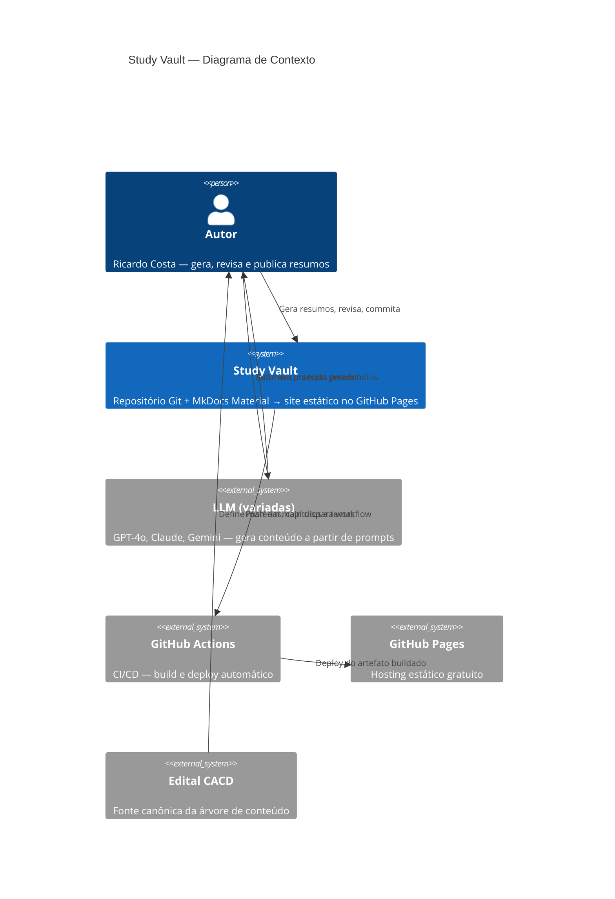
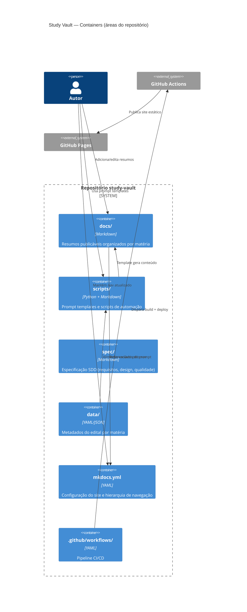

# Arquitetura do Sistema — Study Vault

> **Artefato RUP:** Documento de Arquitetura (Análise & Design)
> **Proprietário:** [RUP] Arquiteto
> **Status:** Complete
> **Última atualização:** 2026-07-19

---

## 1. Visão Geral

Study Vault é um **pipeline de geração de conteúdo estático** — não um sistema de software convencional. A "arquitetura" aqui é a soma de: estrutura de diretórios, formato dos artefatos, ferramentas de automação, pipeline de validação e CI/CD de publicação.

O sistema recebe como **entrada** o programa do edital do CACD e a bibliografia de referência, transforma isso em **resumos densos via LLM** mediados por um prompt template parametrizado, e publica o resultado como **site estático** via MkDocs Material no GitHub Pages.

### Diagrama de Contexto (C4 Level 1)



### Diagrama de Containers (C4 Level 2)

Adaptado ao contexto de pipeline de conteúdo — "containers" aqui são **áreas funcionais do repositório**, não serviços em execução.



---

## 2. Estrutura de Diretórios Canônica

A estrutura abaixo é a **referência normativa** do projeto. Diretórios e arquivos devem seguir essa organização.

```
study-vault/
├── docs/                           # Conteúdo publicável (fonte do MkDocs)
│   ├── index.md                    # Home do site — tabela de matérias, disclaimer
│   ├── javascripts/
│   │   └── mathjax.js              # Config MathJax para fórmulas LaTeX
│   ├── historia-mundial/           # Uma matéria = um diretório
│   │   ├── index.md                # Dashboard de progresso da matéria
│   │   ├── 01-01-slug.md           # CC-TT-slug.md — um tema = um arquivo
│   │   ├── 01-02-slug.md
│   │   └── ...
│   ├── economia/
│   │   ├── index.md
│   │   └── ...
│   └── <nova-materia>/             # Extensível: mesma estrutura
│       ├── index.md
│       └── ...
├── scripts/                        # Tooling e automação
│   ├── prompts/                    # Prompt templates
│   │   ├── summary.md              # Template base
│   │   └── summary-<materia>.md    # Variantes por matéria (quando necessário)
│   └── validate.py                 # Script de validação de conformidade (proposto)
├── data/                           # Metadados estruturados do edital
│   ├── historia-mundial.yml        # Capítulos, temas, bibliografias (proposto)
│   └── economia.yml
├── spec/                           # Especificação SDD (não publicada)
│   └── docs/
│       ├── 00-overview/
│       ├── 01-business/
│       ├── 02-requirements/
│       ├── 03-design/              # ← este documento
│       ├── 04-implementation/
│       ├── 05-test/
│       ├── 06-deployment/
│       └── 07-change-management/
├── mkdocs.yml                      # Configuração do site + nav
├── .github/
│   └── workflows/
│       └── deploy.yml              # CI/CD pipeline
└── README.md
```

### Convenções de Naming

| Elemento | Formato | Exemplo |
|----------|---------|---------|
| Diretório de matéria | `kebab-case`, sem acentos | `historia-mundial/` |
| Arquivo de resumo | `CC-TT-slug.md` (zero-padded) | `01-05-crise-de-1929-e-new-deal.md` |
| Índice de matéria | `index.md` | `docs/economia/index.md` |
| Prompt template base | `summary.md` | `scripts/prompts/summary.md` |
| Prompt variante | `summary-<materia>.md` | `scripts/prompts/summary-economia.md` |
| Metadado do edital | `<materia>.yml` | `data/economia.yml` |

---

## 3. Pipeline de Conteúdo

O pipeline possui 4 estágios sequenciais com 1 loop de feedback:

```mermaid
flowchart LR
    subgraph "1. Planejamento"
        P1[Consultar edital]
        P2[Criar estrutura]
        P3[Levantar bibliografia]
    end

    subgraph "2. Geração"
        G1[Preencher prompt]
        G2[Submeter à LLM]
        G3[Avaliar output]
        G4[Montar arquivo .md]
    end

    subgraph "3. Validação"
        V1[Checklist de conformidade]
        V2[Build local]
    end

    subgraph "4. Publicação"
        PU1[Commit + push]
        PU2[GitHub Actions build]
        PU3[Deploy GitHub Pages]
    end

    P1 --> P2 --> P3 --> G1
    G1 --> G2 --> G3
    G3 -->|OK| G4
    G3 -->|Ajustar| G1
    G4 --> V1
    V1 -->|Aprovado| V2
    V1 -->|Desvio| G4
    V2 -->|OK| PU1 --> PU2 --> PU3
    V2 -->|Erro| G4
```



### Estágio 1 — Planejamento (manual, 1× por matéria)
- Consultar programa do edital → identificar capítulos e temas
- Criar diretório `docs/<materia>/` + `index.md` com todos os temas listados
- Levantar bibliografia de referência
- Avaliar necessidade de variante do prompt template
- Atualizar `mkdocs.yml` e `docs/index.md`

### Estágio 2 — Geração (manual, 1× por tema)
- Preencher variáveis do prompt template
- Submeter à LLM escolhida (interface manual)
- Avaliar output contra RF-09, RF-22, RF-12 a RF-15
- Montar arquivo final: frontmatter + metadata + admonition + conteúdo + rodapé

### Estágio 3 — Validação (manual hoje, automatizável)
- Checklist de conformidade (RF-33): 7 verificações
- Build local (`mkdocs serve`) para detectar erros de renderização
- **Recomendação: automatizar via `scripts/validate.py`** (ver ADR-005)

### Estágio 4 — Publicação (semi-automática)
- Commit + push (manual)
- GitHub Actions dispara build automaticamente
- Deploy para GitHub Pages em ~2-5 minutos

---

## 4. Decisões Arquiteturais (ADRs)

### ADR-001: MkDocs Material como motor de publicação

- **Status:** Aceita
- **Contexto:** O projeto precisa de um gerador de site estático que suporte Markdown, busca full-text, MathJax, Mermaid, admonitions e tema responsivo. O único operador é o Autor (single-user), e o deploy deve ser gratuito e sem infraestrutura.
- **Decisão:** Usar MkDocs com o tema Material.
- **Alternativas descartadas:**
  - **Docusaurus** — mais pesado (React/Node.js), overkill para conteúdo puramente textual. Overhead de build mais alto. Busca requer plugin adicional.
  - **Hugo** — build mais rápido, mas ecossistema de extensões (admonitions, superfences) menos maduro. Templating em Go menos acessível para manutenção.
  - **Jekyll** — nativo do GitHub Pages, mas extensibilidade limitada (sem MathJax/Mermaid nativos). Ecossistema estagnado.
  - **Notion/Obsidian Publish** — lock-in proprietário, sem versionamento Git, sem CI/CD customizável.
- **Consequências:** Dependência de `mkdocs-material` como pacote Python. Extensões markdown (pymdownx) cobrem todas as necessidades identificadas (MathJax, Mermaid, admonitions, tabs). Busca client-side integrada sem infra adicional. Deploy trivial via GitHub Pages.

### ADR-002: Monorepo (conteúdo + spec + tooling + CI/CD)

- **Status:** Aceita
- **Contexto:** O projeto tem conteúdo (resumos), especificação (SDD), scripts de automação e configuração de CI/CD. Separar em múltiplos repositórios complicaria versionamento e rastreabilidade.
- **Decisão:** Manter tudo em um único repositório Git.
- **Alternativas descartadas:**
  - **Repo separado para spec** — quebraria a rastreabilidade spec↔conteúdo no mesmo commit. Overhead de sincronização desproporcional para single-user.
  - **Repo separado para scripts** — desnecessário com 1-3 scripts. Complexidade sem benefício.
- **Consequências:** `spec/` não é publicado no site (excluído pelo MkDocs que só processa `docs/`). Versionamento atômico: mudança de requisito + mudança de template + mudança de conteúdo no mesmo commit quando necessário. Trade-off: o repositório público inclui a spec SDD — aceitável, pois o projeto é educacional.

### ADR-003: Prompt template como artefato derivado (inversão de dependência)

- **Status:** Aceita
- **Contexto:** Na prática atual, o prompt template (`scripts/prompts/summary.md`) funciona como "spec informal" — é a referência de facto para o formato dos resumos. Isso impede rastreabilidade formal e extensibilidade controlada.
- **Decisão:** Os requisitos (`spec/docs/02-requirements/requirements.md`) são a fonte de verdade. O prompt template é uma **implementação executável** dos requisitos, derivado deles.
- **Alternativas descartadas:**
  - **Prompt como fonte de verdade** — funciona para um operador, mas impede que QA verifique conformidade contra spec formal. Dificulta variantes por matéria com rastreabilidade.
- **Consequências:** Alterações nas regras de conteúdo devem ser feitas primeiro nos requisitos e depois propagadas ao template (NFR-11). O template pode ter variantes por matéria sem divergir da spec. QA pode verificar conformidade de resumos contra requisitos formais. O Autor precisa manter disciplina de cascata (requisito → template → resumo).

### ADR-004: Metadados do edital em YAML (`data/`)

- **Status:** Proposta
- **Contexto:** Atualmente, as informações do edital (matérias, capítulos, temas, bibliografias) estão implícitas no `mkdocs.yml` (nav) e nos `index.md` de cada matéria. Isso gera duplicação e risco de inconsistência. O prompt template requer variáveis (`{capitulo}`, `{tema}`, `{subtemas_irmaos}`, `{bibliografia}`) que o Autor preenche manualmente toda vez.
- **Decisão:** Criar arquivos YAML em `data/` com a estrutura canônica de cada matéria: capítulos, temas (com slug, edital_ref, título), e bibliografia de referência. Esses arquivos alimentam a geração de `index.md`, o nav do `mkdocs.yml`, e o preenchimento automático das variáveis do prompt.
- **Alternativas descartadas:**
  - **Manter tudo implícito** — funciona, mas o preenchimento manual de 6 variáveis por tema é tedioso e propenso a erro com 7+ matérias.
  - **Banco de dados (SQLite)** — overkill para ~300 temas. YAML é legível, versionável e editável sem ferramentas.
- **Consequências:** Introduz `data/` como single source of truth para a árvore do edital. Scripts podem gerar automaticamente: (1) `index.md` de cada matéria, (2) seção `nav` do `mkdocs.yml`, (3) variáveis preenchidas do prompt. Trade-off: mais um artefato pra manter — justificável quando o projeto ultrapassar 3 matérias. **Resolve UQ-007 parcialmente** — o YAML pode incluir campos `data_geracao` e `modelo_llm` para backfill semi-automatizado.

### ADR-005: Validação automatizada via script Python (`scripts/validate.py`)

- **Status:** Proposta
- **Contexto:** RF-33 define um checklist de conformidade com 7 verificações. UC-05 descreve o fluxo de validação manual. Executar essas verificações manualmente em 84+ resumos é impraticável. O AF-01 do UC-05 já prevê automação.
- **Decisão:** Implementar `scripts/validate.py` que verifica programaticamente: (a) frontmatter completo, (b) 5 seções presentes, (c) word count 2.000–4.000, (d) metadata blockquote, (e) admonition de temas irmãos, (f) rodapé com disclaimer, (g) naming do arquivo.
- **Alternativas descartadas:**
  - **Linter markdown genérico (markdownlint)** — verifica formatação, mas não entende semântica do projeto (seções obrigatórias, campos de frontmatter específicos, word count).
  - **GitHub Action com custom check** — possível, mas o script local é mais útil (valida antes do push, não depois).
  - **Schema JSON para frontmatter** — parcial, só cobre frontmatter. O script cobre tudo.
- **Consequências:** O script deve ser integrável ao CI/CD (ver `ci_cd_pipeline.md`). Output: lista de desvios por arquivo com severidade (ERRO/AVISO). O script pode ser executado localmente (`python scripts/validate.py`) ou no GitHub Actions como quality gate pré-build. **Responde UQ-007:** backfill dos 84 resumos pode usar o script para diagnosticar desvios e gerar relatório de migração — execução da correção continua manual (as mudanças são semânticas, não só mecânicas).

### ADR-006: Geração manual de conteúdo (sem API de LLM)

- **Status:** Aceita
- **Contexto:** O volume total é finito (~300 temas). A geração via interface manual da LLM permite iteração rápida (prompt refinement em tempo real), avaliação humana inline, e flexibilidade de modelo.
- **Decisão:** Manter geração manual. Não integrar APIs de LLM.
- **Alternativas descartadas:**
  - **Script Python com API OpenAI/Anthropic** — automatiza mas remove a avaliação humana inline. Risco de gerar 300 resumos com erro sistêmico (prompt com bug) sem perceber. Custo financeiro de tokens. Complexidade de gestão de múltiplas APIs (GPT, Claude, Gemini).
  - **Pipeline LangChain/LangGraph** — over-engineering extremo para submissão de prompt + coleta de output. Adiciona dependências pesadas sem benefício proporcional.
- **Consequências:** O gargalo é o tempo humano, não throughput de API. Aceitável para ~300 temas. Se o projeto escalar para dezenas de matérias (outros concursos), essa decisão deve ser reavaliada. Valida AS-03 (ausência de automação é escolha pragmática).

### ADR-007: Deploy direto em `main` (sem staging)

- **Status:** Aceita
- **Contexto:** O projeto é single-user, de estudo pessoal. Build failures são detectáveis via GitHub Actions e corrigíveis em minutos.
- **Decisão:** Push direto em `main` dispara deploy. Sem branch de staging ou ambiente de preview.
- **Alternativas descartadas:**
  - **Branch `develop` + PR para `main`** — overhead de processo desproporcional para single-user. PRs sem reviewer são burocracia vazia.
  - **GitHub Pages preview via PR** — possível (deploy preview em branch), mas adiciona complexidade ao workflow sem benefício real.
- **Consequências:** Qualquer push em `main` vai para produção. Mitigação: build local (`mkdocs serve`) antes do push + validação automatizada (ADR-005) como quality gate no CI. Se o projeto ganhar colaboradores, essa decisão deve ser revista (ADR supersedida).

### ADR-008: Backfill dos 84 resumos — diagnóstico automatizado, correção manual

- **Status:** Proposta
- **Contexto:** RF-38 a RF-41 exigem padronização dos 84 resumos existentes (título do frontmatter de Economia, seções Conexões/Top 5, campos `data_geracao`/`modelo_llm`, rodapé). UQ-007 questiona se isso deve ser manual ou via script.
- **Decisão:** Usar `scripts/validate.py` para **diagnosticar** todos os desvios e gerar relatório de migração. A **correção** é manual porque: (a) títulos do frontmatter de Economia requerem julgamento semântico (qual é o tema correto?), (b) seções Conexões/Top 5 podem precisar de conteúdo novo (não só rename), (c) o Autor precisa escolher valores de backfill com contexto.
- **Alternativas descartadas:**
  - **Script de correção automática end-to-end** — perigoso para 84 arquivos com variações semânticas. Risco de corrupção de conteúdo. O diagnóstico é o gargalo real — a correção manual é <2 min por arquivo.
  - **Ignorar backfill** — inaceitável: projeto público com 84 resumos inconsistentes mina credibilidade.
- **Consequências:** O backfill é um **lote de migração**, não uma feature recorrente. Estimativa: 84 arquivos × ~2 min/arquivo = ~3h de trabalho manual (após diagnóstico automatizado). Script gera relatório CSV/markdown com: arquivo, desvio, valor atual, valor esperado.

---

## 5. Tooling Proposto

### 5.1 `scripts/validate.py` — Validador de Conformidade

**Propósito:** Automatiza o checklist de conformidade RF-33 / UC-05.

**Verificações implementáveis:**

| # | Verificação | Severidade | RFs |
|---|-------------|------------|-----|
| 1 | Frontmatter YAML presente e parseable | ERRO | RF-02 |
| 2 | Campos obrigatórios: `title`, `edital_ref`, `capitulo`, `materia`, `concurso`, `status`, `data_geracao`, `modelo_llm` | ERRO | RF-02, RF-05, RF-06 |
| 3 | Formato de `title`: `"<ano> - <concurso> - <matéria> - <tema>"` | ERRO | RF-03 |
| 4 | `status` é um de: `completo`, `em_revisao`, `pendente` | ERRO | RF-04 |
| 5 | `data_geracao` no formato ISO 8601 | AVISO | RF-05 |
| 6 | Metadata blockquote presente (linhas com `>` após H1) | ERRO | RF-07 |
| 7 | Admonition de temas irmãos presente (`!!! info`) | ERRO | RF-08 |
| 8 | Seções obrigatórias presentes (Conexões + Top 5 no mínimo) | ERRO | RF-09 |
| 9 | Word count entre 2.000 e 4.000 | AVISO | RF-22 |
| 10 | Rodapé com disclaimer LLM presente | AVISO | RF-11 |
| 11 | Naming do arquivo conforme `CC-TT-slug.md` | ERRO | RF-17 |

**Interface:**
```bash
# Validar tudo
python scripts/validate.py

# Validar uma matéria
python scripts/validate.py --materia economia

# Validar um arquivo
python scripts/validate.py docs/economia/01-01-demanda-do-consumidor.md

# Gerar relatório de migração (backfill)
python scripts/validate.py --report backfill-report.md
```

**Dependências:** apenas stdlib Python (re, yaml, pathlib, argparse). Sem dependências externas.

### 5.2 `scripts/generate_nav.py` — Gerador de Nav (futuro)

**Propósito:** Gera automaticamente a seção `nav` do `mkdocs.yml` a partir dos arquivos em `docs/` e dos metadados em `data/`. Resolve RF-21 (risco de esquecer entrada no nav).

**Decisão:** Implementar quando o projeto ultrapassar 3 matérias. Com 2 matérias e 84 temas, o nav manual é gerenciável (embora tedioso).

---

## 6. Preocupações Transversais

### 6.1 Rastreabilidade
- **Cadeia:** Edital → Requisitos (RF-XX) → Prompt Template → Resumo → Site
- Frontmatter registra: `edital_ref`, `concurso`, `materia`, `capitulo`, `modelo_llm`, `data_geracao`
- Cada resumo é rastreável até o requisito que define seu formato

### 6.2 Observabilidade
- Build status via badge do GitHub Actions no README
- Relatório de validação (`validate.py`) como proxy de qualidade
- Tabela de progresso no `docs/index.md` e em cada `index.md` de matéria

### 6.3 Segurança e Privacidade
- O projeto é **público** — nenhum dado sensível no repositório
- Disclaimers de IA em dois níveis: home (geral) e rodapé de cada resumo (modelo específico)
- Sem credenciais, tokens ou dados pessoais no repositório

### 6.4 Extensibilidade
- Adicionar nova matéria: criar `data/<materia>.yml` + seguir checklist RF-35
- Adicionar novo concurso: adaptar frontmatter (`concurso`) + variante de prompt
- Mudar LLM: nenhuma mudança estrutural — registrar no `modelo_llm` do frontmatter
