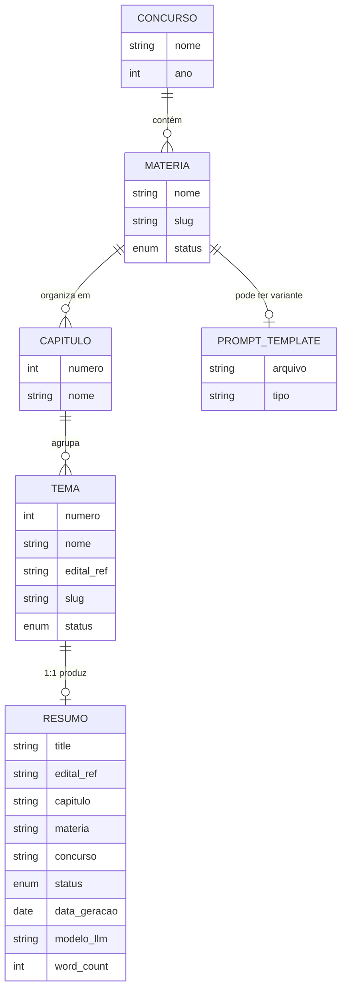
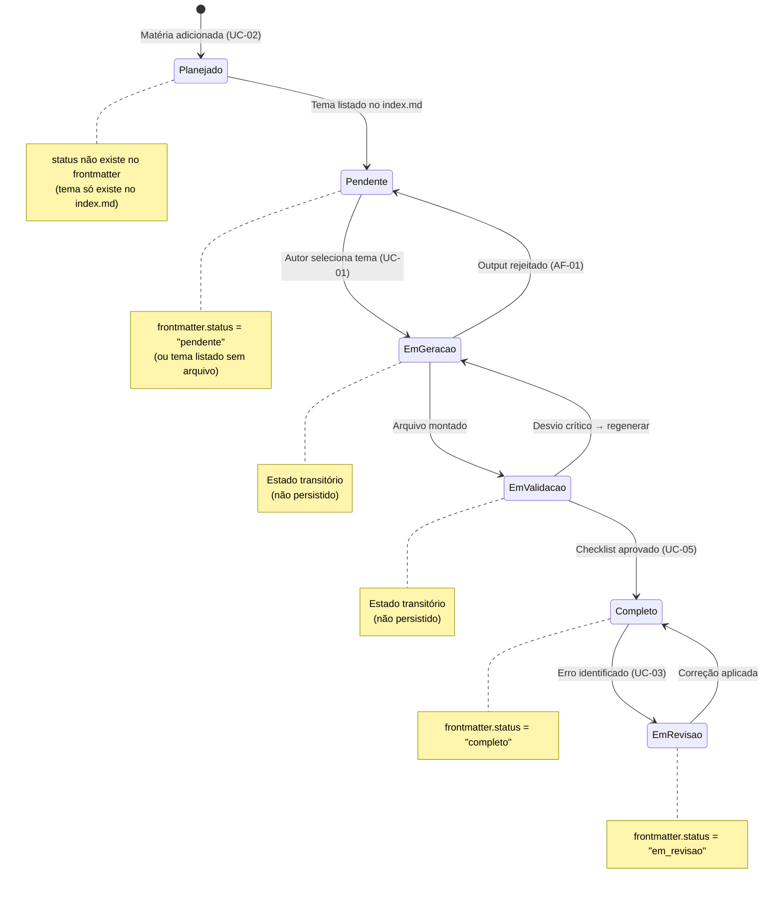

# Modelo de Domínio — Study Vault

> **Artefato RUP:** Modelo de Domínio (Análise & Design)
> **Proprietário:** [RUP] Arquiteto
> **Status:** Complete
> **Última atualização:** 2026-07-19

---

## 1. Visão Geral

O domínio do Study Vault é **conteúdo educacional estruturado**. As entidades não são tabelas de banco de dados — são **conceitos materializados como arquivos e diretórios** no filesystem. O "modelo" é a hierarquia semântica que organiza o conteúdo.

---

## 2. Entidades do Domínio

### 2.1 Concurso

| Atributo | Tipo | Exemplo |
|----------|------|---------|
| `nome` | string | CACD |
| `ano` | int | 2026 |
| `nome_completo` | string | Concurso de Admissão à Carreira de Diplomata |
| `matérias` | lista de Matéria | [História Mundial, Economia, ...] |

**Materialização:** Implícito — presente no frontmatter de cada resumo (`concurso: CACD`) e no `mkdocs.yml` (`site_name`). Não existe como arquivo próprio.

**Regra:** Um projeto Study Vault cobre **um concurso por vez** (CACD 2026). O campo `concurso` no frontmatter identifica o concurso, permitindo extensão futura para outros concursos (BG-07).

### 2.2 Matéria

| Atributo | Tipo | Exemplo |
|----------|------|---------|
| `nome` | string | História Mundial |
| `slug` | string (kebab-case) | historia-mundial |
| `concurso` | ref → Concurso | CACD |
| `capítulos` | lista de Capítulo | [1. Estruturas e Ideias Econômicas, ...] |
| `total_temas` | int (derivado) | 60 |
| `status` | enum | Completo / Em andamento / Planejada |
| `prompt_variante` | string (nullable) | summary-economia.md |

**Materialização:**
- Diretório: `docs/<slug>/` (RF-18)
- Índice: `docs/<slug>/index.md` com tabela de progresso (RF-19)
- Metadados (proposto): `data/<slug>.yml` (ADR-004)
- Navegação: seção no `nav` do `mkdocs.yml` (RF-20)
- Home: linha na tabela de matérias de `docs/index.md` (RF-34)

### 2.3 Capítulo

| Atributo | Tipo | Exemplo |
|----------|------|---------|
| `numero` | int | 1 |
| `nome` | string | Estruturas e Ideias Econômicas |
| `matéria` | ref → Matéria | História Mundial |
| `temas` | lista de Tema | [...] |

**Materialização:** O capítulo não tem arquivo próprio — é um **agrupador lógico** no `index.md` da matéria e no `nav` do `mkdocs.yml`. Os dois primeiros dígitos do nome do arquivo (`CC-TT-slug.md`) codificam o capítulo.

### 2.4 Tema

| Atributo | Tipo | Exemplo |
|----------|------|---------|
| `numero` | int | 5 |
| `nome` | string | Crise de 1929 e New Deal |
| `capítulo` | ref → Capítulo | 1 |
| `edital_ref` | string | 1.5 |
| `slug` | string | crise-de-1929-e-new-deal |
| `status` | enum | pendente / em_revisao / completo |

**Materialização:** Entrada na tabela do `index.md` da matéria. Quando status = `completo`, existe um Resumo correspondente.

**Regra invariante:** Mapeamento **1:1** entre Tema e Resumo (BR-001 / RF-01). Um tema nunca pode gerar múltiplos arquivos, nem múltiplos temas podem ser fundidos em um arquivo.

### 2.5 Resumo

| Atributo | Tipo | Materialização |
|----------|------|----------------|
| `title` | string | frontmatter YAML |
| `edital_ref` | string | frontmatter YAML |
| `capitulo` | string | frontmatter YAML |
| `materia` | string | frontmatter YAML |
| `concurso` | string | frontmatter YAML |
| `status` | enum | frontmatter YAML |
| `data_geracao` | date (ISO 8601) | frontmatter YAML |
| `modelo_llm` | string | frontmatter YAML |
| `conteúdo` | markdown | corpo do arquivo |
| `word_count` | int (derivado) | calculado pelo validador |

**Materialização:** Arquivo `docs/<materia>/<CC-TT-slug>.md` (RF-17).

**Composição interna do arquivo:**
1. Frontmatter YAML (bloco `---`)
2. Título H1
3. Metadata blockquote (`>`)
4. Admonition de temas irmãos (`!!! info`)
5. Seções de conteúdo (5 obrigatórias)
6. Rodapé com disclaimer

---

## 3. Relacionamentos

### Cardinalidade

| Relação | Cardinalidade | Nota |
|---------|---------------|------|
| Concurso → Matéria | 1:N | CACD tem 7 matérias planejadas |
| Matéria → Capítulo | 1:N | Economia: 5 capítulos; HM: 8 capítulos |
| Capítulo → Tema | 1:N | Variável (1 a 17 temas por capítulo) |
| Tema → Resumo | 1:0..1 | 1:1 quando gerado; 1:0 quando pendente |
| Matéria → Prompt Template | 1:0..1 | Variante é opcional; template base é default |

---

## 4. Ciclo de Vida de um Resumo

### Estados Persistidos vs. Transitórios

| Estado | Persistido? | Onde? |
|--------|-------------|-------|
| Planejado | Sim | Matéria existe, tema não listado individualmente |
| Pendente | Sim | `index.md` da matéria (tema listado, sem arquivo ou com `status: pendente`) |
| Em Geração | Não | Estado mental do Autor — tema em processo de geração |
| Em Validação | Não | Arquivo existe localmente, ainda não commitado |
| Completo | Sim | `frontmatter.status = "completo"` |
| Em Revisão | Sim | `frontmatter.status = "em_revisao"` |

### Transições e Gatilhos

| De | Para | Gatilho | UC |
|----|------|---------|----|
| — | Planejado | Matéria adicionada ao projeto | UC-02 |
| Planejado | Pendente | Todos os temas da matéria listados no index.md | UC-02 |
| Pendente | Em Geração | Autor seleciona tema para gerar | UC-01 |
| Em Geração | Em Geração | Output insatisfatório → resubmissão | UC-01 AF-01 |
| Em Geração | Em Validação | Arquivo montado com frontmatter + conteúdo | UC-01 |
| Em Validação | Completo | Checklist aprovado (manual ou `validate.py`) | UC-05 |
| Em Validação | Em Geração | Desvio crítico → regeneração | UC-05 EF-01 |
| Completo | Em Revisão | Erro identificado pelo Autor | UC-03 |
| Em Revisão | Completo | Correção aplicada e validada | UC-03 |

---

## 5. Glossário de Domínio (Resumo)

| Termo | Definição |
|-------|-----------|
| **Edital** | Documento oficial que define matérias, capítulos e temas do concurso |
| **Matéria** | Disciplina cobrada no concurso (ex: História Mundial) |
| **Capítulo** | Agrupamento de temas dentro de uma matéria, definido pelo edital |
| **Tema** | Unidade atômica de conteúdo — corresponde a exatamente 1 resumo |
| **Resumo** | Arquivo markdown denso (~2.000-4.000 palavras) gerado por LLM |
| **Frontmatter** | Bloco YAML no topo do arquivo com metadados estruturados |
| **Prompt Template** | Modelo parametrizado que instrui a LLM a gerar o resumo |
| **Variante** | Versão adaptada do prompt template para matérias com necessidades específicas |
| **Backfill** | Processo de padronização retroativa dos resumos existentes |

> Glossário completo: `spec/docs/01-business/glossary.md`
