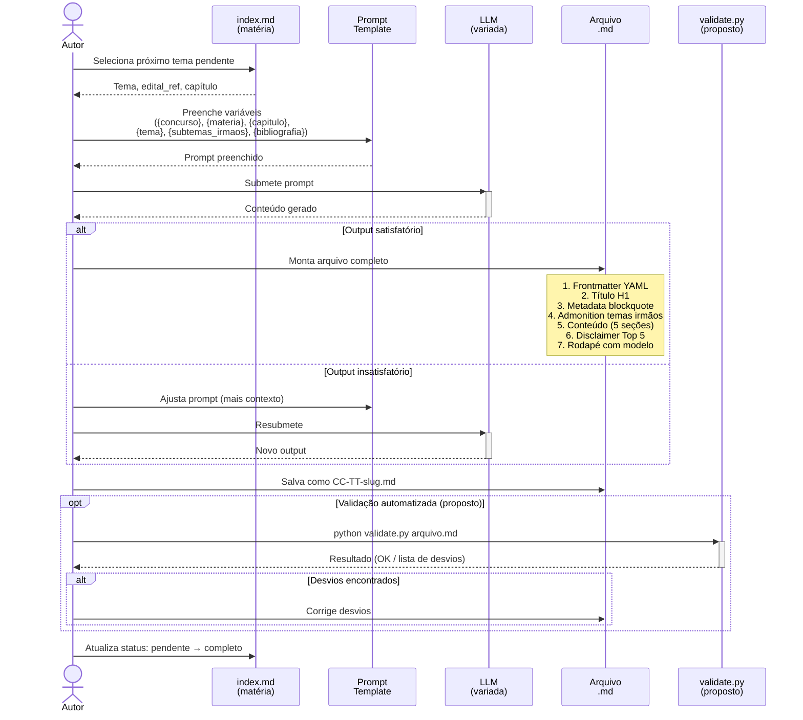
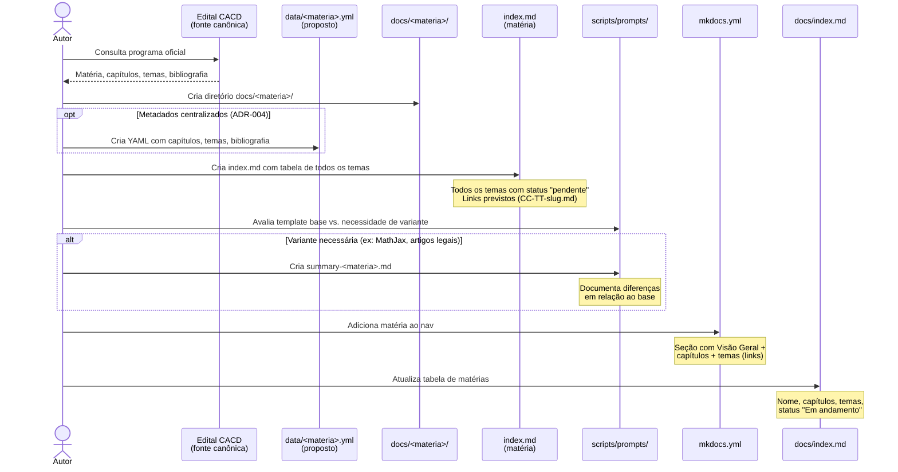
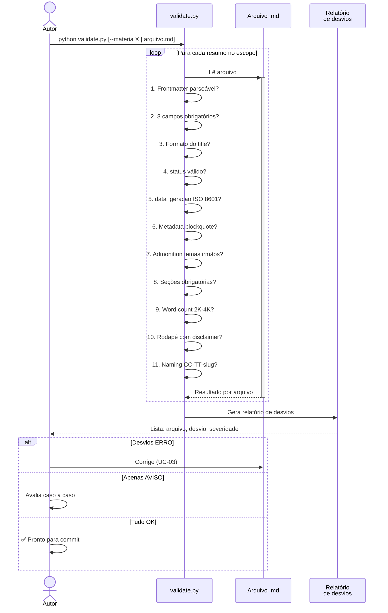
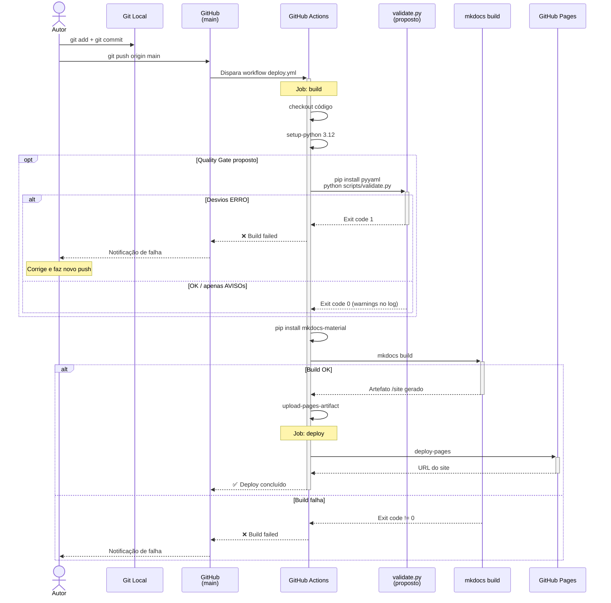
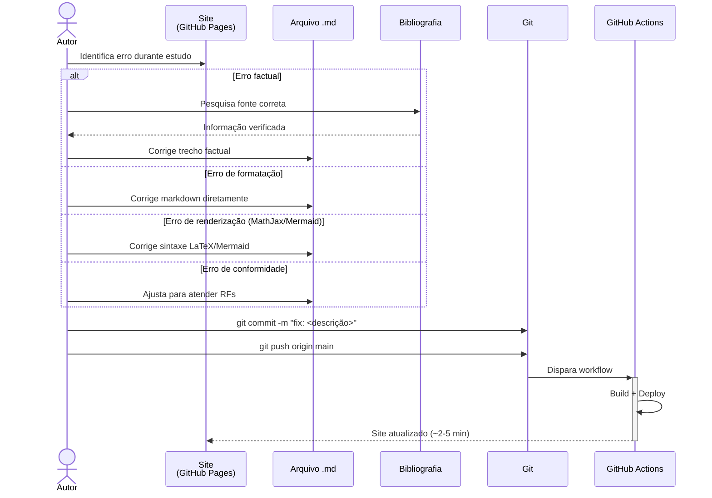

# Diagramas de Sequência — Study Vault

> **Artefato RUP:** Diagramas de Sequência (Análise & Design)
> **Proprietário:** [RUP] Arquiteto
> **Status:** Complete
> **Última atualização:** 2026-07-19

---

## 1. Fluxo de Geração de Resumo (UC-01)

Fluxo end-to-end desde a seleção do tema até o resumo pronto para commit.



---

## 2. Fluxo de Onboarding de Nova Matéria (UC-02)

Fluxo desde a decisão de adicionar uma matéria até a estrutura pronta para geração.



---

## 3. Fluxo de Validação Pós-Geração (UC-05)

Fluxo do checklist de conformidade — manual ou automatizado.



---

## 4. Fluxo de CI/CD — Push → Build → Deploy (UC-04)

Fluxo do pipeline atual com melhorias propostas (quality gate de validação).



---

## 5. Fluxo de Backfill de Resumos Existentes (RF-38 a RF-41)

Processo único de migração para padronizar os 84 resumos existentes.

```mermaid
sequenceDiagram
    actor Autor
    participant Validador as validate.py<br>--report
    participant Relatorio as backfill-report.md
    participant Resumo as Arquivos .md<br>(84 resumos)
    participant Git as Git

    Note over Autor: Processo único de migração

    Autor->>+Validador: python validate.py --report backfill-report.md
    Validador->>Validador: Varre todos os 84 resumos
    Validador->>Validador: Detecta: títulos fora do padrão,<br>campos ausentes, seções faltando,<br>rodapé ausente
    Validador-->>-Relatorio: Relatório por arquivo:<br>desvio | valor atual | valor esperado

    Autor->>Relatorio: Revisa relatório

    loop Para cada resumo com desvios
        Autor->>+Resumo: Abre arquivo
        Note over Autor, Resumo: RF-38: Ajusta title de Economia<br>RF-39: Verifica Conexões/Top 5<br>RF-40: Adiciona data_geracao e modelo_llm<br>RF-41: Adiciona rodapé
        Autor->>-Resumo: Salva correções
    end

    Autor->>+Validador: python validate.py
    Validador-->>-Autor: Verificação final: 0 erros

    Autor->>Git: git add + commit + push
    Note over Git: "fix: padroniza frontmatter e<br>estrutura de todos os resumos<br>conforme RF-38 a RF-41"
```

---

## 6. Fluxo de Revisão e Correção (UC-03)

Fluxo reativo quando o Autor identifica um erro em resumo publicado.


