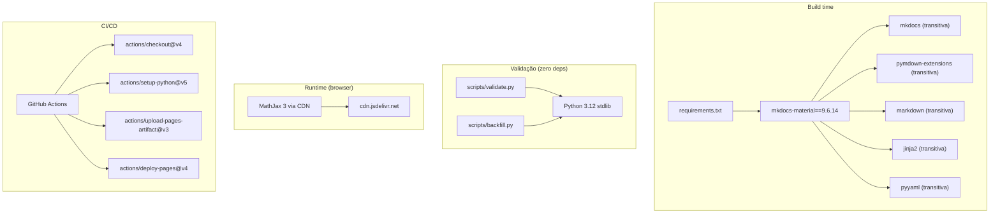

# Mapa de Dependências — Study Vault

> **Artefato RUP:** Dependency Map (Implementação)
> **Proprietário:** [RUP] Desenvolvedor
> **Status:** Complete
> **Última atualização:** 2026-07-21

---

## 1. Visão Geral

O Study Vault tem uma árvore de dependências intencionalmente minimalista. A filosofia é: se não precisa de uma dependência, não adicione.



---

## 2. Dependências de Build

### 2.1 Dependência Direta

| Pacote | Versão | Arquivo | Propósito |
|--------|--------|---------|-----------|
| `mkdocs-material` | `9.6.14` | `requirements.txt` | Tema + extensões + MkDocs core |

### 2.2 Dependências Transitivas

Resolvidas automaticamente pelo pip ao instalar `mkdocs-material`:

| Pacote | Trazido por | Propósito |
|--------|-------------|-----------|
| `mkdocs` | mkdocs-material | Core do gerador de site estático |
| `pymdown-extensions` | mkdocs-material | Extensões Markdown avançadas |
| `markdown` | mkdocs | Parser Python-Markdown |
| `jinja2` | mkdocs | Template engine para temas |
| `pyyaml` | mkdocs | Parser YAML para mkdocs.yml |
| `ghp-import` | mkdocs | Deploy para GitHub Pages (não usado — deploy via Actions) |
| `watchdog` | mkdocs | File watching para `mkdocs serve` |
| `markupsafe` | jinja2 | Escape de HTML |
| `mergedeep` | mkdocs | Deep merge de configs |
| `pyyaml-env-tag` | mkdocs | Variáveis de ambiente em YAML |
| `pathspec` | mkdocs | Pattern matching (gitignore-style) |
| `platformdirs` | mkdocs | Diretórios de plataforma |

### 2.3 Política de Versionamento

- **Pin apenas mkdocs-material** — é meta-pacote, resolve o grafo completo
- **Sem `requirements-lock.txt`** — pip resolve deterministicamente dado o pin
- **Atualização mensal** — atualizar local, testar com `mkdocs build --strict`, atualizar pin
- **Cooldown de 7 dias** — não adotar versões com menos de 1 semana de release

---

## 3. Dependências para Scripts de Automação

### 3.1 validate.py

| Módulo | Tipo | Propósito |
|--------|------|-----------|
| `re` | stdlib | Regex para frontmatter e seções |
| `pathlib` | stdlib | Manipulação de paths |
| `argparse` | stdlib | CLI arguments |
| `sys` | stdlib | Exit codes |

### 3.2 backfill.py

| Módulo | Tipo | Propósito |
|--------|------|-----------|
| `re` | stdlib | Regex para frontmatter |
| `pathlib` | stdlib | Manipulação de paths |
| `argparse` | stdlib | CLI arguments |
| `sys` | stdlib | Exit codes |
| `os` | stdlib | (importado, não utilizado ativamente) |

### 3.3 Zero Dependências Externas

Decisão documentada em ADR-005. Os scripts rodam **antes** do `pip install` no CI. Se dependessem de PyYAML ou outro pacote, o pipeline perderia o fail-fast (teria que instalar deps antes de validar).

---

## 4. Dependência de Runtime (Browser)

| Recurso | URL | Versão | Propósito | Fallback |
|---------|-----|--------|-----------|----------|
| MathJax 3 | `cdn.jsdelivr.net/npm/mathjax@3/es5/tex-mml-chtml.min.js` | 3.x (latest via CDN) | Renderização LaTeX no browser | Fórmulas exibidas em LaTeX raw (legível, degradação graciosa) |

**Configuração** em `mkdocs.yml`:
```yaml
extra_javascript:
  - javascripts/mathjax.js
  - https://cdn.jsdelivr.net/npm/mathjax@3/es5/tex-mml-chtml.min.js
```

O arquivo `docs/javascripts/mathjax.js` configura MathJax para reconhecer delimitadores `$...$` e `$$...$$`.

---

## 5. Dependências de CI/CD (GitHub Actions)

| Action | Versão | Propósito |
|--------|--------|-----------|
| `actions/checkout` | `v4` | Checkout do repositório |
| `actions/setup-python` | `v5` | Instala Python 3.12 + cache pip |
| `actions/upload-pages-artifact` | `v3` | Upload do artefato buildado |
| `actions/deploy-pages` | `v4` | Deploy para GitHub Pages |

### Versionamento de Actions

Actions são pinadas por **major version** (`@v4`), não por SHA. Isso é prática padrão do GitHub — major versions são tags estáveis com backward compatibility garantida. Para projetos com requisitos de segurança mais rigorosos, considerar pin por SHA.

---

## 6. Dependências Internas (Repositório)

| Artefato | Depende de | Natureza |
|----------|------------|----------|
| `docs/<materia>/*.md` | `scripts/prompts/summary.md` | Gerado a partir do template |
| `scripts/validate.py` | Nada | Standalone |
| `scripts/backfill.py` | Nada | Standalone |
| `mkdocs.yml` | `docs/` | Referencia arquivos no `nav` |
| `.github/workflows/deploy.yml` | `requirements.txt`, `scripts/validate.py` | Usa no pipeline |
| `requirements.txt` | Nada | Fonte de verdade de deps |

---

## 7. Ausência Intencional de Dependências

| Candidata | Por que não | Ref |
|-----------|-------------|-----|
| PyYAML | Frontmatter é flat, regex resolve. Adicionaria dep ao validate | ADR-005 |
| markdownlint | Verifica formatação genérica, não semântica do projeto | ADR-005 |
| pre-commit | Overhead de tooling desproporcional para single-user | ADR-007 |
| Docker | Nenhuma infra para containerizar | — |
| Node.js | Nenhuma dependência JS (MathJax é CDN, Mermaid é pymdownx) | — |
| pytest | Scripts são simples o bastante para não justificar framework de teste | Escopo |
