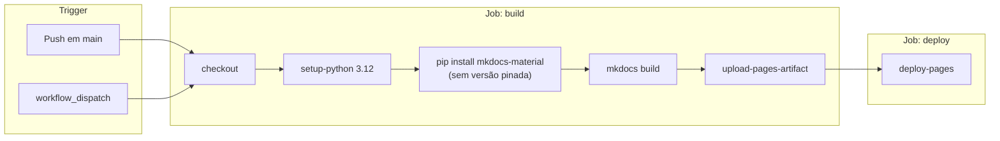
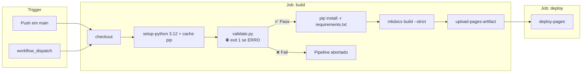

# Pipeline de CI/CD — Study Vault

> **Artefato RUP:** Pipeline de CI/CD (Deployment)
> **Proprietário:** [RUP] Arquiteto
> **Status:** Complete
> **Última atualização:** 2026-07-21

---

## 1. Pipeline Atual

O pipeline atual é minimalista: push em `main` → build → deploy. Sem quality gates, sem pinning de versão.

### 1.1 Diagrama



### 1.2 Workflow Atual (`deploy.yml`)

```yaml
name: Deploy MkDocs to GitHub Pages

on:
  push:
    branches: [main]
  workflow_dispatch:

permissions:
  contents: read
  pages: write
  id-token: write

concurrency:
  group: pages
  cancel-in-progress: false

jobs:
  build:
    runs-on: ubuntu-latest
    steps:
      - uses: actions/checkout@v4
      - uses: actions/setup-python@v5
        with:
          python-version: '3.12'
      - run: pip install mkdocs-material
      - run: mkdocs build
      - uses: actions/upload-pages-artifact@v3
        with:
          path: site

  deploy:
    needs: build
    runs-on: ubuntu-latest
    environment:
      name: github-pages
      url: ${{ steps.deployment.outputs.page_url }}
    steps:
      - id: deployment
        uses: actions/deploy-pages@v4
```

### 1.3 Problemas Identificados

| # | Problema | Risco | Severidade | Ref |
|---|----------|-------|------------|-----|
| 1 | **Sem pinning de versão** (`pip install mkdocs-material` instala latest) | Build quebra silenciosamente por breaking change upstream | Alto | NFR-14 |
| 2 | **Sem quality gate** pré-build | Resumos com frontmatter inválido, seções faltando ou word count fora da faixa chegam a produção | Médio | RF-33, NFR-06 |
| 3 | **Sem cache** de dependências pip | Download redundante a cada build (~30s) | Baixo | — |
| 4 | `cancel-in-progress: false` | Pushes rápidos em sequência acumulam builds redundantes na fila | Baixo | — |
| 5 | **Sem `--strict`** no `mkdocs build` | Warnings (links quebrados, arquivos no nav que não existem) passam silenciosamente | Médio | NFR-07 |

---

## 2. Pipeline Proposto

Adiciona validação como quality gate, pina dependências, habilita cache e modo strict.

### 2.1 Princípios de Design

- **Fail fast:** validação de conteúdo roda antes do build — se falha, o build nem começa.
- **Um job, três stages:** validate → build → deploy são steps sequenciais dentro de 2 jobs (validate+build num job, deploy noutro). Separar validate em job próprio desperdiça ~40s de setup (checkout + setup-python) para um script que roda em <5s.
- **Dependência zero para validação:** `scripts/validate.py` usa apenas stdlib Python (re, pathlib, argparse + `yaml` parser embutido via regex), conforme ADR-005. Não precisa de `pip install` adicional.
- **Reprodutibilidade:** `requirements.txt` com versão exata do `mkdocs-material`.

### 2.2 Diagrama



### 2.3 Workflow Proposto (`deploy.yml`)

```yaml
name: Deploy MkDocs to GitHub Pages

on:
  push:
    branches: [main]
  workflow_dispatch:

permissions:
  contents: read
  pages: write
  id-token: write

concurrency:
  group: pages
  cancel-in-progress: true  # Cancela builds obsoletos

jobs:
  build:
    runs-on: ubuntu-latest
    steps:
      - uses: actions/checkout@v4

      - uses: actions/setup-python@v5
        with:
          python-version: '3.12'
          cache: pip

      - name: Validate content conformity
        run: python scripts/validate.py

      - name: Install dependencies
        run: pip install -r requirements.txt

      - name: Build site
        run: mkdocs build --strict

      - uses: actions/upload-pages-artifact@v3
        with:
          path: site

  deploy:
    needs: build
    runs-on: ubuntu-latest
    environment:
      name: github-pages
      url: ${{ steps.deployment.outputs.page_url }}
    steps:
      - id: deployment
        uses: actions/deploy-pages@v4
```

### 2.4 `requirements.txt` (novo arquivo na raiz)

```
mkdocs-material==9.6.14
```

> **Sobre pinning:** `9.6.14` é a última versão estável na data deste documento (2026-07-21). `mkdocs-material` é meta-pacote — puxa `mkdocs`, `pymdown-extensions`, `markdown`, `jinja2` como dependências transitivas. Pinar apenas ele garante reprodutibilidade suficiente. Para lock completo: `pip freeze > requirements-lock.txt`.
>
> **Atualização:** periodicamente (`~mensal`), rodar local `pip install --upgrade mkdocs-material`, testar com `mkdocs build --strict` + `mkdocs serve`, e atualizar o pin manualmente no `requirements.txt`.

### 2.5 Diferenças: Atual → Proposto

| Aspecto | Atual | Proposto | Motivação |
|---------|-------|----------|-----------|
| Quality gate | Nenhum | `validate.py` como step pré-build | RF-33, NFR-06, NFR-07 |
| Pinning | Nenhum (`pip install mkdocs-material`) | `requirements.txt` com versão exata | Reprodutibilidade (NFR-14) |
| Cache pip | Não | Sim (`cache: pip` no setup-python) | Economia de ~30s por build |
| `cancel-in-progress` | `false` | `true` | Evita builds redundantes |
| `mkdocs build` | Sem `--strict` | Com `--strict` | Warnings viram erros (links quebrados, nav inconsistente) |
| Jobs | 2 (build + deploy) | 2 (build + deploy), validação como step | Evita overhead de setup duplicado |

---

## 3. Quality Gates

### 3.1 Gate 1 — Validação de Conteúdo (`validate.py`)

Roda **antes** do `pip install` — sem dependências externas (ADR-005).

| Verificação | Severidade | Exit Code | Comportamento |
|-------------|------------|-----------|---------------|
| Frontmatter YAML presente e parseável | ERRO | 1 | ⛔ Bloqueia build |
| Campos obrigatórios no frontmatter (`title`, `edital_ref`, `capitulo`, `materia`, `concurso`, `status`) | ERRO | 1 | ⛔ Bloqueia build |
| Formato do `title`: `"<ano> - <concurso> - <matéria> - <tema>"` | ERRO | 1 | ⛔ Bloqueia build |
| `status` ∈ {`completo`, `em_revisao`, `pendente`} | ERRO | 1 | ⛔ Bloqueia build |
| Seções obrigatórias presentes (Conexões, Top 5) | ERRO | 1 | ⛔ Bloqueia build |
| Naming do arquivo conforme `CC-TT-slug.md` | ERRO | 1 | ⛔ Bloqueia build |
| Metadata blockquote presente | ERRO | 1 | ⛔ Bloqueia build |
| Admonition de temas irmãos (`!!! info`) | ERRO | 1 | ⛔ Bloqueia build |
| Word count entre 2.000 e 4.000 | AVISO | 0 | ⚠️ Log, não bloqueia |
| `data_geracao` em formato ISO 8601 | AVISO | 0 | ⚠️ Log, não bloqueia |
| Rodapé com disclaimer LLM | AVISO | 0 | ⚠️ Log, não bloqueia |

**Princípio:** ERROs bloqueiam (integridade estrutural). AVISOs logam (qualidade desejável).

### 3.2 Gate 2 — Build MkDocs (`mkdocs build --strict`)

| Verificação | Comportamento |
|-------------|---------------|
| `mkdocs.yml` parseável | ⛔ Bloqueia |
| Arquivos no `nav` existem no filesystem | ⛔ Bloqueia (com `--strict`) |
| Markdown parseável | ⛔ Bloqueia |
| Extensões carregam sem erro | ⛔ Bloqueia |
| MathJax/Mermaid válidos | Não verificado (renderização client-side) |

---

## 4. Observabilidade do Pipeline

| Sinal | Onde | Como |
|-------|------|------|
| Build status | README do repo | Badge: `` |
| Validação failures | GitHub Actions log | Output do `validate.py` — lista de desvios por arquivo |
| Build failures | GitHub Actions log | Output do `mkdocs build --strict` |
| Deploy URL | GitHub Environments | Output do step `deploy-pages` |
| Histórico de deploys | GitHub Environments | Aba "Deployments" do repositório |

---

## 5. Operações Manuais

| Operação | Comando | Quando |
|----------|---------|--------|
| Validar localmente | `python scripts/validate.py` | Antes de cada push |
| Validar matéria específica | `python scripts/validate.py --materia economia` | Ao editar temas de uma matéria |
| Preview local | `mkdocs serve` | Verificação visual antes do push |
| Build local (teste) | `mkdocs build --strict` | Testar se build passará no CI |
| Forçar deploy | `workflow_dispatch` via GitHub UI | Deploy sem novo commit |
| Atualizar dependência | Editar versão no `requirements.txt` → testar local → push | ~Mensalmente |
| Relatório de backfill | `python scripts/validate.py --report backfill.md` | 1×, para migração (ADR-008) |

---

## 6. Estratégia de Deploy

| Atributo | Valor | Ref |
|----------|-------|-----|
| Estratégia | **Deploy direto** (push → build → produção) | ADR-007 |
| Rollback | Git revert + push | Manual, ~2 min |
| Staging | Nenhum (ADR-007: proporcional para single-user) | — |
| Preview de PR | Não implementado | Reavaliável se o projeto ganhar colaboradores |
| Tempo push→produção | ~2-3 min | Estimativa com cache |
