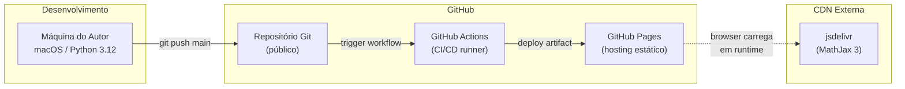

# Infraestrutura — Study Vault

> **Artefato RUP:** Infraestrutura (Deployment)
> **Proprietário:** [RUP] Arquiteto
> **Status:** Complete
> **Última atualização:** 2026-07-21

---

## 1. Visão Geral

A infraestrutura do Study Vault é **intencionalmente minimalista**. O projeto é um site estático sem backend, sem banco de dados, sem servidores gerenciados. Toda a infraestrutura é fornecida gratuitamente pelo ecossistema GitHub, com uma única dependência externa de runtime: MathJax via CDN.



---

## 2. Componentes de Infraestrutura

### 2.1 Ambiente de Desenvolvimento (local)

| Componente | Versão | Propósito |
|------------|--------|-----------|
| macOS | — | SO do Autor |
| Python | 3.12 | Runtime para MkDocs e scripts de validação |
| Git | ≥ 2.x | Versionamento |
| mkdocs-material | **9.6.14** (versão exata) | Tema + extensões + MkDocs core |
| Editor | Qualquer (VS Code, Vim, etc.) | Edição de Markdown |
| Browser | Qualquer moderno | Preview local (`mkdocs serve`) |

**Setup local:**
```bash
# Clone + setup
git clone <repo-url>
cd study-vault
pip install -r requirements.txt

# Preview local
mkdocs serve
# → http://localhost:8000

# Build local (reproduz o CI)
mkdocs build --strict

# Validação de conformidade
python scripts/validate.py
```

### 2.2 Repositório Git (GitHub)

| Atributo | Valor |
|----------|-------|
| Plataforma | GitHub |
| Visibilidade | Público |
| Branch principal | `main` |
| Branch protection | Nenhum (single-user, ADR-007) |
| Linguagem predominante | Markdown |
| Tamanho estimado | ~5 MB (84+ resumos × ~15 KB + assets + spec) |

### 2.3 CI/CD (GitHub Actions)

| Atributo | Valor |
|----------|-------|
| Runner | `ubuntu-latest` (GitHub-hosted) |
| Python | 3.12 (via `actions/setup-python@v5`) |
| Trigger | Push em `main` + `workflow_dispatch` |
| Tempo de build | ~1–2 min (com cache pip) |
| Custo | Gratuito (GitHub Free: 2.000 min/mês) |
| Consumo estimado | ~60 min/mês (1 deploy/dia × ~2 min) |
| Concorrência | 1 por vez (`concurrency.group: pages`) |
| Pipeline | validate → build → deploy (ver `ci_cd_pipeline.md`) |

### 2.4 Hosting (GitHub Pages)

| Atributo | Valor |
|----------|-------|
| Tipo | Site estático (HTML/CSS/JS) |
| Domínio | `<username>.github.io/study-vault` (ou custom domain) |
| HTTPS | Automático (Let's Encrypt via GitHub) |
| CDN | GitHub Pages CDN (Fastly) |
| SLA | ~99.5% (SLA informal do GitHub Pages) |
| Limite de tamanho | 1 GB por site |
| Bandwidth | 100 GB/mês (soft limit) |
| Build source | GitHub Actions (artifact-based deploy) |

### 2.5 Dependência Externa de Runtime

| Dependência | URL | Propósito | Risco | Mitigação |
|-------------|-----|-----------|-------|-----------|
| MathJax 3 | `cdn.jsdelivr.net/npm/mathjax@3/es5/tex-mml-chtml.js` | Renderização de fórmulas LaTeX no browser | CDN indisponível → fórmulas exibidas em LaTeX raw | jsdelivr SLA >99.9%; fallback é legível (degradação graciosa) |

> **Nota:** MathJax é carregado pelo browser do leitor, não durante o build. Se o CDN estiver fora, o conteúdo textual permanece intacto — apenas as fórmulas perdem formatação visual. Fórmulas são usadas principalmente na matéria de Economia.

---

## 3. Dependências de Build

### 3.1 Árvore de Dependências

```
requirements.txt
└── mkdocs-material==9.6.14    ← único pin explícito
    ├── mkdocs                 ← core do gerador de sites
    ├── pymdown-extensions     ← extensões Markdown
    │   ├── pymdownx.superfences   (Mermaid, code blocks)
    │   ├── pymdownx.arithmatex    (MathJax integration)
    │   ├── pymdownx.tabbed
    │   ├── pymdownx.highlight
    │   ├── pymdownx.details
    │   ├── pymdownx.mark
    │   ├── pymdownx.critic
    │   └── pymdownx.keys
    ├── markdown               ← Python-Markdown
    │   ├── admonition
    │   ├── attr_list
    │   ├── md_in_html
    │   ├── tables
    │   └── toc (com permalink)
    ├── jinja2                 ← templating engine
    └── pyyaml                 ← YAML parser (transitiva)
```

### 3.2 `requirements.txt`

```
mkdocs-material==9.6.14
```

**Por que apenas uma linha?** O `mkdocs-material` é meta-pacote: puxa `mkdocs`, `pymdown-extensions`, `markdown`, `jinja2` e `pyyaml` como dependências transitivas. Pinar apenas ele é suficiente para reprodutibilidade — pip resolve o grafo deterministicamente. Para lock completo, gerar `pip freeze > requirements-lock.txt`.

### 3.3 Dependência para Validação (`scripts/validate.py`)

O script de validação usa **apenas stdlib Python** (ADR-005): `re`, `pathlib`, `argparse`, e parsing manual de frontmatter YAML via regex (o frontmatter do projeto é simples o bastante para não precisar de parser YAML completo).

**Não precisa de `pip install` adicional no CI.** O step de validação roda antes da instalação de dependências — se falhar, o `pip install` nem executa. Isso é intencional: a validação não deve depender do ecossistema MkDocs.

> **Alternativa descartada:** usar `pyyaml` no validate.py. Adicionaria dependência desnecessária (o frontmatter é flat, sem aninhamento) e exigiria instalar pip antes da validação, quebrando o princípio fail-fast.

---

## 4. Risco: Dependência Sem Pinning (Estado Atual)

O workflow atual (`deploy.yml`) faz `pip install mkdocs-material` **sem versão fixa**. Isso significa que cada build pode instalar uma versão diferente.

### 4.1 Cenários de Falha

| Cenário | Probabilidade | Impacto | Exemplo |
|---------|---------------|---------|---------|
| Breaking change em major version | Baixa | Build quebra | mkdocs-material 10.x altera estrutura de config |
| Incompatibilidade de extensão | Média | Build quebra silenciosamente ou renderiza errado | pymdownx muda API de `superfences` |
| Regressão em minor version | Baixa | Bug visual sutil | CSS do tema muda, layout quebra em mobile |
| Pacote removido do PyPI | Muito baixa | Build impossível | Supply chain attack ou takedown |

### 4.2 Recomendação

**Criar `requirements.txt` com versão exata** — já detalhado no pipeline proposto (`ci_cd_pipeline.md`, seção 2.4).

```
mkdocs-material==9.6.14
```

**Procedimento de atualização:**
1. Local: `pip install --upgrade mkdocs-material`
2. Testar: `mkdocs build --strict && mkdocs serve` → navegar o site
3. Atualizar pin: editar `requirements.txt`
4. Commit + push → CI valida automaticamente

---

## 5. Configuração do MkDocs (`mkdocs.yml`)

### 5.1 Extensões Habilitadas

| Extensão | Propósito | Usada por |
|----------|-----------|-----------|
| `admonition` | Blocos `!!! info/note/warning/tip` | Temas irmãos (RF-08), observações |
| `pymdownx.details` | Admonitions colapsáveis | Conteúdo opcional |
| `pymdownx.superfences` | Fences customizados (Mermaid) | Diagramas em resumos (RF-26) |
| `pymdownx.tabbed` | Abas de conteúdo | Comparações entre teorias |
| `pymdownx.highlight` | Syntax highlighting | Blocos de código (eventual) |
| `pymdownx.arithmatex` | MathJax/LaTeX integration | Fórmulas em Economia (RF-25) |
| `pymdownx.mark` | Texto marcado (`==texto==`) | Destaques visuais |
| `pymdownx.critic` | Markup de revisão | — |
| `pymdownx.keys` | Representação de teclas | — |
| `attr_list` | Atributos em elementos HTML | Customização de imagens |
| `md_in_html` | Markdown dentro de blocos HTML | Layouts customizados |
| `tables` | Tabelas Markdown | Tabelas em resumos |
| `toc` | Table of contents com permalink | Navegação intra-página |

### 5.2 Features do Tema Material

| Feature | Propósito |
|---------|-----------|
| `navigation.sections` | Agrupa itens por seção no sidebar |
| `navigation.expand` | Expande sidebar automaticamente |
| `navigation.top` | Botão "voltar ao topo" |
| `search.highlight` | Destaca termos buscados no resultado |
| `search.suggest` | Auto-complete na barra de busca |
| `content.tabs.link` | Sincroniza abas entre seções |
| `toc.integrate` | Integra TOC no sidebar (em vez de painel separado) |

### 5.3 Busca

```yaml
plugins:
  - search:
      lang: pt
```

Busca full-text client-side em português, integrada ao tema Material. Sem infra adicional (Algolia, Elasticsearch) — busca indexa durante o build e roda em JavaScript no browser.

---

## 6. Ambientes

| Ambiente | URL | Propósito | Quem acessa |
|----------|-----|-----------|-------------|
| Local | `http://localhost:8000` | Preview e validação visual | Autor |
| Produção | `https://<user>.github.io/study-vault` | Site público | Qualquer pessoa |

> **Sem staging.** Decisão documentada em ADR-007. Deploy direto em produção, mitigado por validação no CI + build local antes do push. Proporcional para projeto single-user educacional.

---

## 7. Monitoramento

| Aspecto | Ferramenta | Tipo |
|---------|------------|------|
| Build health | GitHub Actions badge no README | Passivo |
| Uptime do site | GitHub Status (status.github.com) | Passivo |
| Conformidade de conteúdo | `validate.py` no CI | Automatizado |
| Erros de renderização | `mkdocs serve` local | Manual |
| Uso de bandwidth/storage | GitHub Pages analytics | Sob demanda |

> **Sem alerting ativo** — proporcional ao projeto. Build failure → badge vermelho no README + email automático do GitHub Actions.

---

## 8. Custos

| Recurso | Custo |
|---------|-------|
| GitHub Free (repo + Actions 2.000 min/mês + Pages) | Gratuito |
| CDN MathJax (jsdelivr) | Gratuito |
| Domínio custom (opcional) | ~$12/ano |
| **Total** | **$0 — $12/ano** |

> Infraestrutura com custo zero é uma consequência direta de ADR-001 (MkDocs Material) + ADR-007 (deploy direto). Não existe cenário de escalabilidade que gere custos — GitHub Pages suporta até 100 GB/mês de bandwidth, e o site completo (~300 temas) caberá em <50 MB.
